# Enterprise BI Architecture &mdash; Reference Blueprint

> A vendor-neutral-but-Microsoft-centric reference architecture for delivering
> **governed, self-service business intelligence at enterprise scale** on
> **Microsoft Fabric + Power BI + Snowflake**. It captures the patterns I have
> applied across Banking/Payments, Healthcare, Retail, Telecom, and Oil &amp; Gas —
> the operating model, the platform layers, the governance and security design,
> the dimensional modeling standards, and the KPI framework that tie a BI estate
> together.
>
> This repository is the *architecture* layer that sits above the four delivery
> repositories in this portfolio:
> [Fabric Enterprise Analytics](../01-Microsoft-Fabric-Enterprise-Analytics),
> [Power BI Executive Dashboard](../02-PowerBI-Executive-Dashboard),
> [Azure ADF ETL Pipeline](../03-Azure-ADF-ETL-Pipeline), and
> [SQL Performance Tuning](../04-SQL-Performance-Tuning).

---

## 1. What In this repository contains

| Area | Document |
|------|----------|
| End-to-end reference architecture (layers, flows, decisions) | [`docs/reference-architecture.md`](docs/reference-architecture.md) |
| Logical architecture diagram (SVG) | [`docs/reference-architecture.svg`](docs/reference-architecture.svg) |
| Medallion / domain mesh layering | [`docs/data-platform-layers.md`](docs/data-platform-layers.md) |
| Governance operating model &amp; BI Center of Excellence | [`governance/governance-model.md`](governance/governance-model.md) |
| Security: RLS / OLS / RBAC design | [`governance/security-rls-ols.md`](governance/security-rls-ols.md) |
| Security model diagram (SVG) | [`governance/security-model.svg`](governance/security-model.svg) |
| Dimensional / data-warehouse design standards | [`models/dimensional-design.md`](models/dimensional-design.md) |
| KPI framework &amp; metric governance | [`models/kpi-framework.md`](models/kpi-framework.md) |

---

## 2. Architecture at a glance i used

```mermaid
flowchart LR
    subgraph SRC["Source Systems"]
        S1[Snowflake]
        S2[SQL Server / Oracle / Azure SQL]
        S3[SAP / Dynamics 365 / Salesforce]
        S4[REST &amp; OData APIs]
        S5[Files / ACORD XML / Flat]
    end

    subgraph INGEST["Ingestion &amp; Integration"]
        I1[ADF / Fabric Data Factory]
        I2[Dataflow Gen2 - Power Query M]
        I3[Databricks - PySpark / Delta]
    end

    subgraph LAKE["OneLake / Lakehouse - Medallion"]
        B[Bronze - Raw]
        SI[Silver - Conformed]
        G[Gold - Star Schema]
    end

    subgraph SERVE["Serving &amp; Semantic"]
        W[Fabric Warehouse]
        SM[Direct Lake Semantic Models]
        AGG[Aggregations / Composite]
    end

    subgraph CONSUME["Consumption"]
        DASH[Power BI Dashboards]
        PAG[Paginated Reports]
        EXCEL[Excel / Analyze in Excel]
        APP[Embedded / Apps]
    end

    subgraph GOV["Governance Spine - cross-cutting"]
        P[Microsoft Purview - lineage, catalog, labels]
        SEC[RLS / OLS / RBAC]
        DP[Deployment Pipelines - Dev/Test/Prod]
        DQ[Data Quality &amp; Reconciliation]
    end

    SRC --> INGEST --> LAKE --> SERVE --> CONSUME
    GOV -.governs.- INGEST
    GOV -.governs.- LAKE
    GOV -.governs.- SERVE
    GOV -.governs.- CONSUME
```

---

## 3. Design principles I Followed

1. **Single governed source of truth, many tailored views.** One conformed Gold
   layer and a set of certified semantic models; business areas build their own
   reports on top, not their own copies of the data.
2. **Push compute to where the data lives.** Heavy transformation runs in the
   lakehouse / warehouse (Spark, SQL), not in the report. Direct Lake removes the
   import/refresh tax for large models.
3. **Governance is a spine, not a gate.** Lineage, cataloging, sensitivity
   labeling, and access control are applied continuously across every layer —
   designed in, not bolted on before an audit.
4. **Star schema is the contract** between engineering and analytics. Facts and
   conformed dimensions with surrogate keys, documented grain, and SCD policy.
5. **Everything ships through Deployment Pipelines.** Dev → Test → Prod with
   parameterized data sources, source control, and reviewed releases — audit-ready.
6. **Metrics are governed objects.** A KPI exists once, with one definition, one
   owner, and one certified measure — not re-derived per report.

---

## 4. How the Actual layers map to the rest of this portfolio

- **Ingestion &amp; Lakehouse** are implemented concretely in
  [Project 1](../01-Microsoft-Fabric-Enterprise-Analytics) (medallion notebooks,
  Dataflow Gen2) and [Project 3](../03-Azure-ADF-ETL-Pipeline) (metadata-driven
  ADF orchestration with watermark/CDC, retry, dead-letter, monitoring).
- **Serving &amp; Semantic** and **Consumption** are implemented in
  [Project 1](../01-Microsoft-Fabric-Enterprise-Analytics) (Direct Lake model,
  calculation groups) and [Project 2](../02-PowerBI-Executive-Dashboard)
  (executive dashboard, forecasting, drill-through, DAX library).
- **The SQL foundation** under all of it is tuned per
  [Project 4](../04-SQL-Performance-Tuning).
- **This repository** is the governing blueprint: the operating model, security
  design, modeling standards, and KPI framework that make the above repeatable.

---

## 5. Keeping Note on data &amp; scope

All numbers, entity names, and scenarios in this portfolio are **synthetic and
illustrative**, created to demonstrate architecture and engineering patterns.
They do not represent any employer's actual data, systems, or results.
