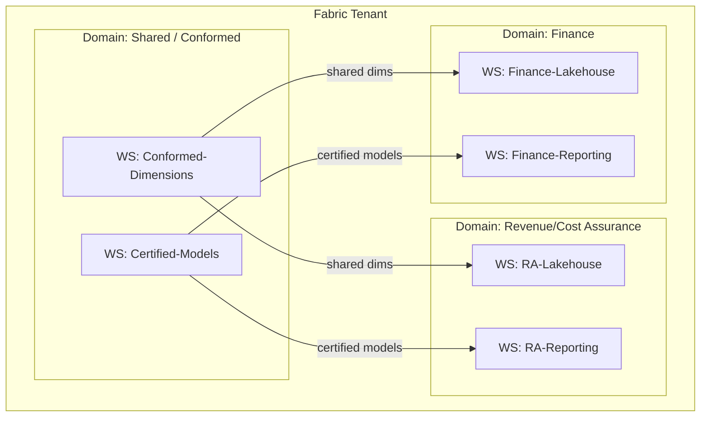

# Data Platform Layers &mdash; Medallion &amp; Domain Organization

This document defines the storage layering rules and how a Fabric estate is
organized into **domains and workspaces** so it scales without turning into a
swamp.

---

## 1. Medallion layering rules

| Layer | Owns | Allowed operations | Not allowed |
|-------|------|--------------------|-------------|
| **Bronze** | Exact source copy + ingest metadata (`_ingest_ts`, `_source`, `_batch_id`) | Append, schema-on-read | Business logic, joins, edits |
| **Silver** | Cleansed, typed, deduplicated, conformed entities with SCD2 history | Cleansing, conforming, dedup, type enforcement, surrogate keys | Report-specific shaping |
| **Gold** | Business-ready **star schema**: fact + conformed dimension tables | Aggregation, star modeling, metric-ready shaping | Raw/untyped data |

**Grain is declared at every layer.** Each Silver and Gold table has a documented
grain statement (e.g. *"one row per invoice line per day"*). Grain confusion is
the number-one source of double-counting in BI.

### Why three layers
- Bronze gives you **replayability** — you can rebuild Silver/Gold from raw without
  re-pulling sources.
- Silver gives you **conformance** — one cleansed version of each business entity,
  shared across all marts.
- Gold gives analytics a **stable contract** — the star schema rarely changes shape
  even when sources churn.

---

## 2. SCD handling

| Type | Use | Implementation |
|------|-----|----------------|
| SCD1 | Attributes where only current value matters (e.g. corrected typo) | Overwrite in Silver |
| SCD2 | Attributes where history matters (e.g. customer segment, territory) | New row + `valid_from` / `valid_to` / `is_current`, MERGE in Silver |
| SCD3 | Rare; "previous + current" only | Extra column |

SCD2 is the default for dimension attributes used in time-based analysis, so a
historical fact joins to the dimension version that was true *at the time*.

---

## 3. Surrogate keys &amp; conformed dimensions

- Every dimension carries a **surrogate key** (integer/hash) independent of the
  source's natural/business key. Facts join on surrogate keys.
- **Conformed dimensions** (Date, Customer, Product, Geography, Account) are built
  once in Silver/Gold and shared across all fact tables and marts — this is what
  lets a "revenue" report and a "cost" report agree on what a customer is.
- A **role-playing dimension** (e.g. Date as Order Date, Ship Date, Invoice Date)
  is modeled once and referenced multiple times rather than copied.

---

## 4. Domain &amp; workspace organization

A large estate is partitioned into **Fabric Domains** (business areas) and
**Workspaces** (delivery units) so ownership and governance are clear.

**Pattern — separate engineering workspaces from reporting workspaces.** Lakehouse
and pipeline development live in a `*-Lakehouse` workspace with tight access;
analysts build in a `*-Reporting` workspace against certified models. Shared and
conformed assets live in their own domain so they are owned centrally, not
duplicated per team.

---

## 5. Naming &amp; standards (excerpt)

| Object | Convention | Example |
|--------|-----------|---------|
| Lakehouse table (Gold) | `fact_*`, `dim_*` | `fact_invoice`, `dim_customer` |
| Workspace | `{Domain}-{Function}-{Env}` | `Finance-Reporting-PROD` |
| Semantic model | `{Subject} Certified Model` | `Revenue Assurance Certified Model` |
| Measure | Business name, no tech prefix | `Net Revenue`, `Revenue Leakage %` |
| Pipeline | `PL_{Verb}_{Scope}` | `PL_Ingest_Metadata_Driven` |

Consistent naming is not cosmetic — it is what makes lineage, deployment rules, and
access policies expressible as patterns rather than per-object exceptions.
