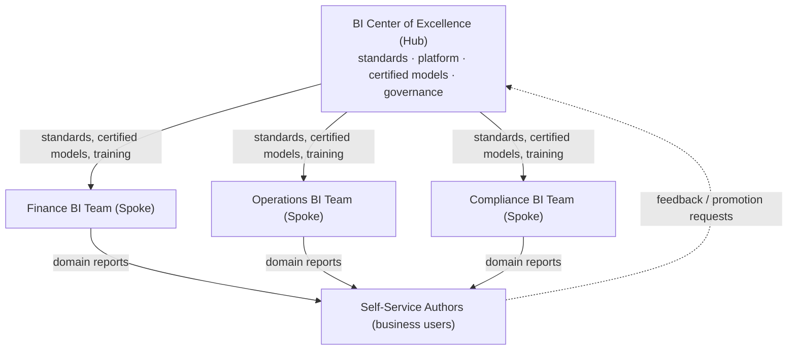
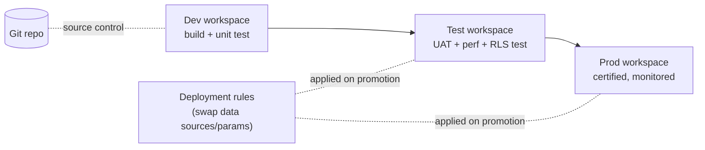

# BI Governance Operating Model &amp; Center of Excellence

> How a BI estate stays trustworthy, compliant, and self-service at the same time.
> This is the operating model — roles, processes, and controls — that wraps the
> [reference architecture](../docs/reference-architecture.md).

---

## 1. Operating model: federated, not centralized or anarchic

Pure centralization creates a bottleneck; pure self-service creates chaos and
conflicting numbers. The workable model is **federated (hub-and-spoke)**:

- **Hub (CoE)** owns the platform, standards, certified semantic models, conformed
  dimensions, security patterns, and the catalog.
- **Spokes** (domain BI teams) own their domain's marts and reports, building on
  certified shared assets.
- **Self-service authors** build personal/team reports on certified models — and
  can request promotion of a good report to "certified" through a review gate.

---

## 2. Roles &amp; responsibilities (RACI excerpt)

| Activity | CoE | Domain BI | Data Eng | Data Owner | Author |
|----------|-----|-----------|----------|-----------|--------|
| Platform &amp; capacity | **A/R** | C | C | I | I |
| Conformed dimensions | **A/R** | C | R | C | I |
| Certified semantic model | **A** | R | C | C | I |
| KPI definition sign-off | C | R | I | **A** | I |
| Domain reports | I | **A/R** | I | C | C |
| Self-service reports | I | C | I | I | **A/R** |
| Access approval (RLS roles) | C | R | I | **A** | I |
| Promotion to "certified" | **A** | R | I | C | I |

*A = Accountable, R = Responsible, C = Consulted, I = Informed.*

---

## 3. Dataset certification &amp; endorsement

Power BI / Fabric endorsement is used deliberately:

| Tier | Meaning | Who can set |
|------|---------|-------------|
| **Certified** | Authoritative, governed, reviewed — safe for executive decisions | CoE only |
| **Promoted** | Good quality, domain-endorsed, not yet fully governed | Domain BI |
| (none) | Personal / experimental | Anyone |

A model becomes **Certified** only after: documented grain &amp; lineage, KPI
definitions signed off by the data owner, RLS tested, performance validated, and a
peer review against the standards checklist.

---

## 4. Change &amp; release management

All shared/certified assets ship through **Deployment Pipelines** with source
control:

- Deployment **rules** repoint data sources and parameters per environment so the
  same artifact runs against Dev/Test/Prod data without manual edits.
- A release requires a reviewed pull request, a passing UAT sign-off, and an
  RLS/performance check.

---

## 5. Data quality &amp; reconciliation

| Control | Where | Example |
|---------|-------|---------|
| Schema/type enforcement | Silver | reject/quarantine rows failing contract |
| Completeness | Silver | row-count vs source watermark delta |
| Validity | Silver | domain checks (status in allowed set) |
| Control totals | Gold | sum(net_revenue) reconciles to source ledger |
| Source-to-report reconciliation | Serving | certified KPI vs system-of-record |

Failures route to a **dead-letter / quarantine** path with alerting (see
[Project 3 monitoring](../../03-Azure-ADF-ETL-Pipeline/docs/monitoring.md)), not
silent drops.

---

## 6. Compliance mapping

The estate is designed to satisfy the regulatory regimes encountered across
domains. Controls are mapped, not improvised:

| Regime | Domain | Primary controls |
|--------|--------|------------------|
| **SOX** | Finance / Payments | Change control, access reviews, lineage, audit-ready release records |
| **GDPR** | Cross-domain (PII) | Sensitivity labels, data minimization, RLS, retention, subject-access support |
| **HIPAA** | Healthcare | PHI labeling, OLS on clinical columns, strict RBAC, access logging |
| **FATCA / AML / KYC** | Banking / Payments | Reconciliation reporting, paginated regulatory outputs, traceability |
| **Regulation W** | Banking | Affiliate-transaction segregation via RLS + certified definitions |

Microsoft Purview provides the lineage, catalog, and sensitivity-label backbone
that makes these auditable end-to-end.

---

## 7. Governance metrics (how we know it's working)

- % of executive reports built on **certified** models (target: high)
- Number of **duplicate/conflicting** KPI definitions (target: → 0)
- Mean time to **provision access** via standard RLS roles
- % of pipelines with **DQ checks** and alerting
- Capacity (**CU**) utilization vs headroom; cost per workspace
- Catalog coverage: % of Gold assets with owner, description, lineage
