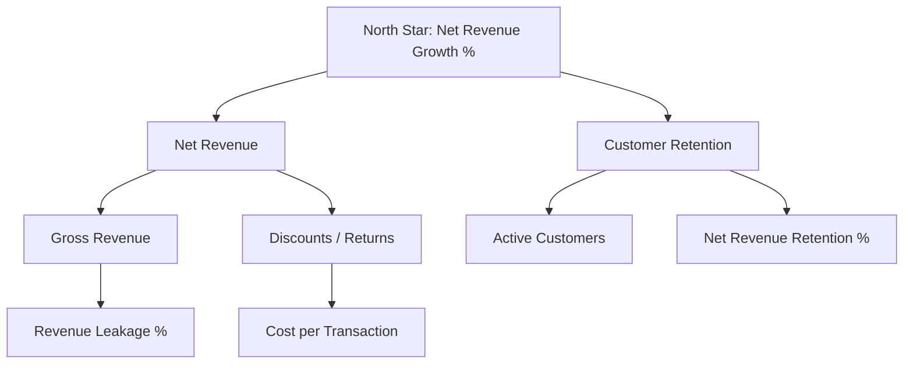
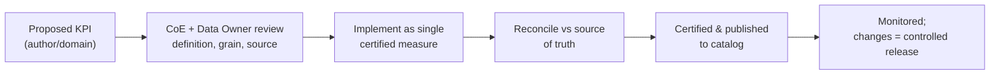

# KPI Framework &amp; Metric Governance

> A metric is an organizational asset, not a report artifact. This framework
> defines how KPIs are specified, owned, certified, and kept consistent so that
> "revenue" means the same thing in every dashboard, deck, and board pack.

---

## 1. The problem this solves

Without metric governance, the same word means different things in different
reports: three teams each build their own "Net Revenue" with subtly different
filters, and the executive meeting spends its time reconciling numbers instead of
making decisions. The fix is a **single governed definition per KPI**, implemented
once as a certified measure, with one owner.

---

## 2. Anatomy of a governed KPI

Every KPI is specified with this metadata before any DAX is written:

| Field | Description |
|-------|-------------|
| **KPI name** | Business name, unambiguous (`Net Revenue`, not `Rev2`) |
| **Definition** | Plain-language meaning |
| **Formula (business)** | e.g. *Gross revenue − discounts − returns* |
| **Grain** | Level at which it is valid (e.g. invoice line) |
| **Owner** | Accountable business data owner |
| **Source of truth** | System / table the value reconciles to |
| **Filters/scope** | Included/excluded statuses, currencies, internal txns |
| **Refresh cadence** | How fresh the number is |
| **Certified measure** | The single DAX measure that implements it |
| **Related KPIs** | Ratios/derivations that depend on it |

---

## 3. Sample KPI catalog (excerpt)

| KPI | Business formula | Grain | Owner | Type |
|-----|------------------|-------|-------|------|
| Net Revenue | Gross − discounts − returns | Invoice line | Finance | Additive |
| Gross Margin % | (Net Revenue − Cost) / Net Revenue | Invoice line | Finance | Ratio |
| Revenue Leakage % | (Expected − Billed) / Expected | Account-month | Rev. Assurance | Ratio |
| Budget Variance % | (Actual − Budget) / Budget | Month | Finance | Ratio |
| YoY Growth % | (Curr − Prior Year) / Prior Year | Any time grain | Finance | Time-int |
| Active Customers | Distinct customers with paid activity | Month | Sales | Semi-additive |
| Net Revenue Retention % | Cohort revenue / base revenue | Cohort-month | Sales | Ratio |
| Cost per Transaction | Total cost / transaction count | Month | Operations | Ratio |

Full DAX implementations live with the delivery repos — e.g.
[Project 1 measures](../../01-Microsoft-Fabric-Enterprise-Analytics/dax/measures.dax)
and [Project 2 measures](../../02-PowerBI-Executive-Dashboard/dax/measures.dax).

---

## 4. KPI tiers &amp; the metric tree

KPIs are organized into a **tree** so executives see a small number of north-star
metrics that decompose into the operational drivers teams act on.

- **Tier 1 (Executive / North Star)** — few, strategic, on the exec dashboard.
- **Tier 2 (Management)** — the drivers that move Tier 1.
- **Tier 3 (Operational)** — what front-line teams monitor and act on daily.

Each tier maps to a report audience and a refresh cadence.

---

## 5. Certification &amp; change control for metrics

- A KPI definition change is a **controlled release**, versioned in the catalog with
  an effective date — because changing a definition retroactively changes history.
- Deprecated KPIs are marked, not silently deleted, so old reports fail loudly
  rather than show stale logic.

---

## 6. Reconciliation &mdash; trust through tie-out

A certified KPI must **reconcile to its system of record**. For each Tier-1 KPI we
maintain a tie-out: certified-model value vs source ledger, within tolerance, on a
schedule. A KPI that cannot be tied out is not certified — full stop. This is what
turns "the dashboard says X" into "X is correct."

---

## 7. How the framework shows up to users

- In the **catalog** (Purview / Fabric): every certified KPI has its definition,
  owner, and lineage discoverable.
- In **reports**: certified measures carry the certified endorsement; tooltips can
  surface the definition.
- In **self-service**: authors reuse certified measures instead of rebuilding them,
  so a new report inherits correct, consistent numbers by default.
