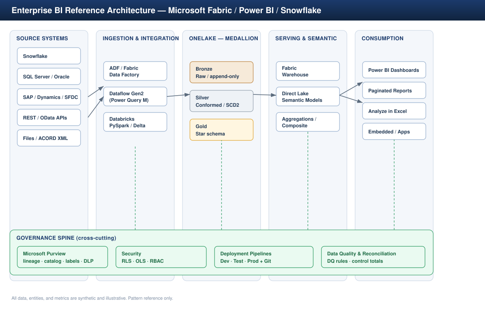

# Reference Architecture

This document describes the enterprise BI reference architecture layer by layer:
what each layer is responsible for, the technology choices, and the design
decisions (with the trade-offs) behind them.

---

## 1. Logical view

The platform is organized into five horizontal layers with a cross-cutting
governance spine:

1. **Source** — operational systems and external feeds
2. **Ingestion &amp; Integration** — movement and orchestration
3. **Storage &amp; Curation (OneLake medallion)** — Bronze / Silver / Gold
4. **Serving &amp; Semantic** — warehouse + certified semantic models
5. **Consumption** — dashboards, paginated reports, Excel, embedded
6. **Governance spine** — applied across all of the above

---

## 2. Source layer

Enterprise BI rarely has one source. The pattern is to classify each source by
**change-capture capability** and **latency requirement**, because that decides
the ingestion mechanism.

| Source class | Examples | Capture method |
|--------------|----------|----------------|
| Cloud DW | Snowflake | Streams &amp; Tasks / timestamp watermark |
| Relational OLTP | SQL Server, Oracle, Azure SQL | CDC or watermark column |
| SaaS / ERP / CRM | SAP, Dynamics 365, Salesforce | OData / REST connectors, delta tokens |
| APIs | Vendor REST, partner feeds | Paged REST pulls, incremental by cursor |
| Files | ACORD XML, flat files, exports | Event/landing-folder triggered |

**Decision — never report directly off OLTP.** Operational systems are protected
from analytical load by landing everything in the lakehouse first. The only
exception is a tightly-scoped DirectQuery/Direct Lake against a replica.

---

## 3. Ingestion &amp; integration layer

Three complementary tools, chosen by job:

- **ADF / Fabric Data Factory** — control-flow orchestration: metadata-driven
  `Lookup → ForEach → Copy` with watermark/CDC, retry, and dead-letter. This is
  the backbone (see [Project 3](../../03-Azure-ADF-ETL-Pipeline)).
- **Dataflow Gen2 (Power Query M)** — low-code, reusable business
  transformations and computed entities feeding governed models, owned closer to
  the business.
- **Databricks / Spark notebooks** — heavy transformation, SCD2 merges, and
  large-scale conforming (see [Project 1](../../01-Microsoft-Fabric-Enterprise-Analytics)).

**Decision — metadata-driven over hand-built pipelines.** A control table drives
which sources load, with what watermark, into which target. One pipeline scales
to dozens of sources and is far cheaper to govern and audit than per-source
copies.

---

## 4. Storage &amp; curation — OneLake medallion

| Zone | Grain &amp; purpose | Format |
|------|-------------------|--------|
| **Bronze** | Raw, append-only, source-faithful + ingest metadata | Delta/Parquet |
| **Silver** | Cleansed, deduplicated, conformed, SCD2 history | Delta |
| **Gold** | Business-ready star schema: facts + conformed dimensions | Delta (V-Order) |

OneLake is the single logical data lake — one copy of the data, addressable by
every Fabric engine (Spark, SQL, Power BI) without duplication. Detailed layer
rules live in [`data-platform-layers.md`](data-platform-layers.md).

---

## 5. Serving &amp; semantic layer

This is where engineering hands off to analytics through a **contract**: the Gold
star schema and the certified semantic models built on it.

- **Fabric Warehouse** — T-SQL serving surface over Gold for SQL consumers and
  for set-based transformations.
- **Direct Lake semantic models** — query Gold Delta tables directly with
  import-like speed and no scheduled refresh; the default for large models.
- **Composite + Aggregations** — where a portion must stay DirectQuery (real-time
  or very large), aggregation tables answer the common queries and only fall
  through to detail when needed.

**Decision — Direct Lake first, DirectQuery only where freshness demands it,
Import only for small/static dimensions.** This minimizes both refresh windows and
query latency. The guardrails (fallback conditions, supported features) are
documented in [Project 1's semantic-model doc](../../01-Microsoft-Fabric-Enterprise-Analytics/docs/semantic-model.md).

---

## 6. Consumption layer

- **Power BI dashboards** — interactive executive and operational reporting with
  drill-through, bookmarks, custom tooltips, and mobile layouts.
- **Paginated Reports** — pixel-perfect regulatory / reconciliation outputs with
  subscriptions (the pattern used for AML/KYC and SOX reporting).
- **Analyze in Excel** — ad-hoc pivot access to certified models for finance.
- **Embedded** — reports surfaced inside line-of-business apps.

All consumption reads **certified** semantic models. Business users build reports;
they do not re-import raw data — that is how a single source of truth survives
self-service.

---

## 7. Governance spine (cross-cutting)

Applied continuously, not at the end:

- **Microsoft Purview** — data map, catalog, end-to-end lineage, sensitivity
  labels, DLP.
- **Security** — RLS / OLS / RBAC, designed in
  [`../governance/security-rls-ols.md`](../governance/security-rls-ols.md).
- **Deployment Pipelines** — Dev / Test / Prod promotion with parameterized rules
  and source control.
- **Data quality &amp; reconciliation** — DQ checks at Silver, control totals at
  Gold, and source-to-report reconciliation.

Full operating model in [`../governance/governance-model.md`](../governance/governance-model.md).

---

## 8. Key cross-cutting decisions summary

| Decision | Choice | Why |
|----------|--------|-----|
| Source isolation | Land in lakehouse, don't report off OLTP | Protect operational systems |
| Ingestion style | Metadata-driven | Scales, auditable, cheap to govern |
| Storage shape | Medallion in OneLake | One copy, multi-engine, clear contracts |
| Model storage | Direct Lake first | Speed without refresh tax |
| Metrics | Centrally governed KPIs | One definition, one owner |
| Promotion | Deployment Pipelines + Git | Audit-ready, repeatable releases |
| Security | RLS/OLS/RBAC + Purview labels | Least privilege, compliance-aligned |
