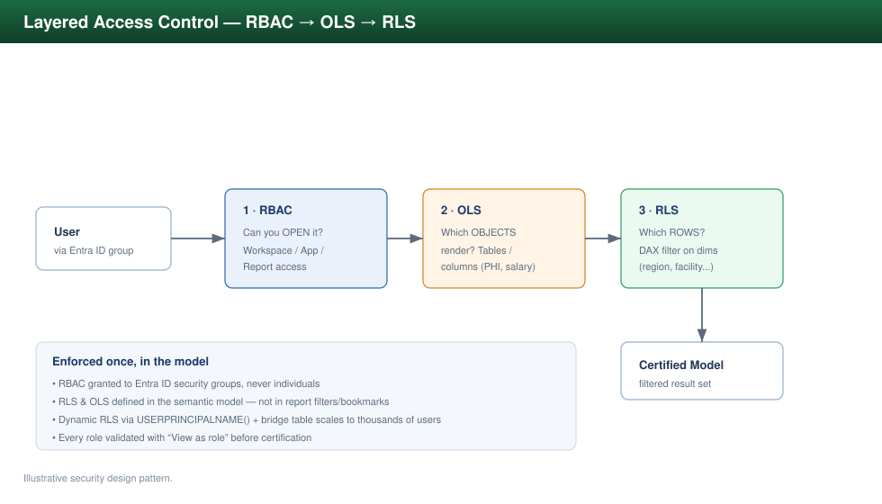

# Security Design &mdash; RLS, OLS &amp; RBAC

> Row-level, object-level, and role-based access control as a coherent design,
> with the actual DAX/role patterns used to implement it. The principle is
> **least privilege enforced once, in the model**, not re-implemented per report.



---

## 1. The three layers of access control

| Control | Restricts | Lives in | Example |
|---------|-----------|----------|---------|
| **RBAC** | *What you can open* (workspace/app/report access) | Fabric/Power BI &amp; Entra ID groups | "Finance Analysts" group can view the Finance app |
| **RLS** | *Which rows you can see* | Semantic model roles + DAX filters | A regional manager sees only their region's rows |
| **OLS** | *Which tables/columns you can see at all* | Semantic model object permissions | Salary / PHI columns hidden from non-privileged roles |

They compose: RBAC gets you into the report, OLS decides which objects render, RLS
decides which rows.

---

## 2. RBAC via Entra ID security groups

Access is **never** granted to individuals on objects. It is granted to **Entra ID
security groups**, and people are added to groups. This keeps access auditable and
makes provisioning/deprovisioning a single membership change.

```
Entra ID Group            ->  Fabric/Power BI role           ->  RLS role mapping
--------------------------------------------------------------------------------
SG-Finance-Viewers        ->  App / Workspace Viewer         ->  (none / all rows in scope)
SG-Region-East-Mgrs       ->  App Viewer                     ->  RLS: Region = "East"
SG-Region-West-Mgrs       ->  App Viewer                     ->  RLS: Region = "West"
SG-Compliance-PHI         ->  App Viewer                     ->  OLS: PHI columns visible
SG-BI-Developers          ->  Workspace Contributor          ->  (dev only)
```

---

## 3. RLS patterns (DAX)

### 3.1 Static role — fixed filter
Simple, one role per scope. Good when scopes are few and stable.

```dax
-- Role: "Region East"  | Table: dim_geography
[Region] = "East"
```

### 3.2 Dynamic RLS — driven by a mapping table (the workhorse)
One role for everyone; the filter resolves from the logged-in user against a
security/bridge table. Scales to thousands of users without per-scope roles.

```dax
-- Role: "Dynamic Region Security"  | Table: dim_geography
VAR CurrentUser = USERPRINCIPALNAME()
RETURN
    [Region] IN
        CALCULATETABLE (
            VALUES ( bridge_user_region[Region] ),
            FILTER (
                ALL ( bridge_user_region ),
                bridge_user_region[UserPrincipalName] = CurrentUser
            )
        )
```

`bridge_user_region` maps `UserPrincipalName → Region` (a user can map to many
rows = many regions). The fact table inherits the filter through the relationship
from `dim_geography`.

### 3.3 Organizational hierarchy RLS (manager sees their subtree)
Uses a `PATH`-based parent/child dimension so a manager sees themselves and
everyone below them.

```dax
-- Role: "Org Hierarchy"  | Table: dim_employee
VAR CurrentUser = USERPRINCIPALNAME()
VAR CurrentKey  =
    LOOKUPVALUE ( dim_employee[EmployeeKey], dim_employee[UPN], CurrentUser )
RETURN
    PATHCONTAINS ( dim_employee[ManagementPath], CurrentKey )
```

`ManagementPath` is built with `PATH(dim_employee[EmployeeKey], dim_employee[ManagerKey])`.

### 3.4 Testing
Every role is validated with **"View as role"** (and "View as other user" for
dynamic roles) before certification. RLS test cases are part of the release
checklist — a wrong filter is a data-leak, so this is non-negotiable.

---

## 4. OLS patterns (object-level security)

OLS hides entire tables or columns from a role — the object simply does not exist
for that user, and any visual or measure depending on it errors gracefully rather
than leaking.

Typical uses:
- **Healthcare**: PHI columns (diagnosis, member SSN) hidden from operational roles;
  visible only to `SG-Compliance-PHI`.
- **Finance**: salary / compensation columns hidden from general finance viewers.

OLS is defined in the model's object permissions (e.g. via Tabular Editor) per
role. **Design note:** because OLS can break visuals that reference a hidden
object, sensitive attributes are isolated into their own tables/measures so that
hiding them degrades gracefully.

---

## 5. Combining RLS + OLS + RBAC — worked example (Healthcare)

| Persona | RBAC | OLS | RLS |
|---------|------|-----|-----|
| Clinical Ops Analyst | Member-Care app viewer | PHI columns hidden | Rows limited to their facility |
| Compliance Officer | Compliance app viewer | PHI columns visible | All facilities |
| Regional Director | Exec app viewer | PHI hidden | Rows for their region (dynamic RLS) |
| BI Developer | Workspace contributor (Dev) | all (Dev only) | none (Dev only) |

The same certified model serves all four; access differs entirely through group
membership and model security — no copies, no per-team forks.

---

## 6. Anti-patterns to avoid

- ❌ RLS implemented in report filters / bookmarks (trivially bypassed) — must be in the model.
- ❌ Granting access to individuals instead of groups (unauditable).
- ❌ Per-region duplicate reports instead of one dynamic-RLS model (maintenance + drift).
- ❌ Sensitive columns left in shared tables relying on "nobody will look" — use OLS.
- ❌ Shipping a model without "View as role" testing.
